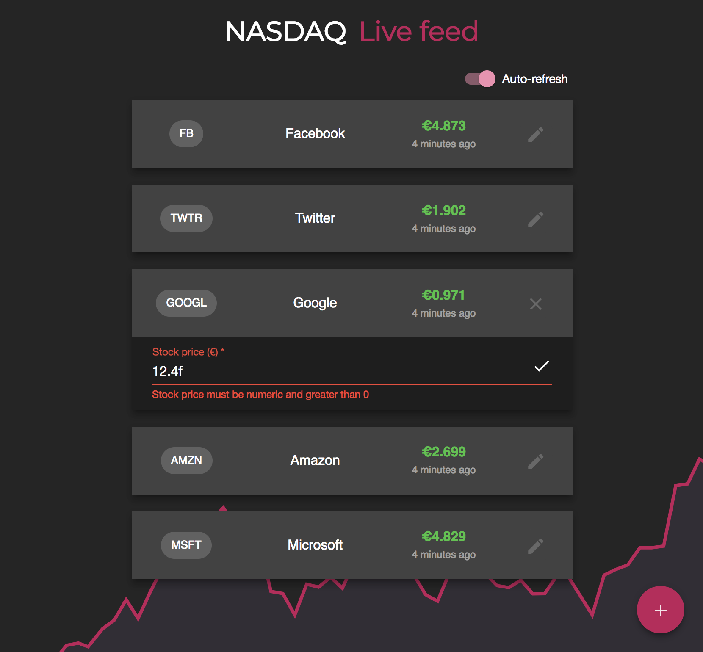
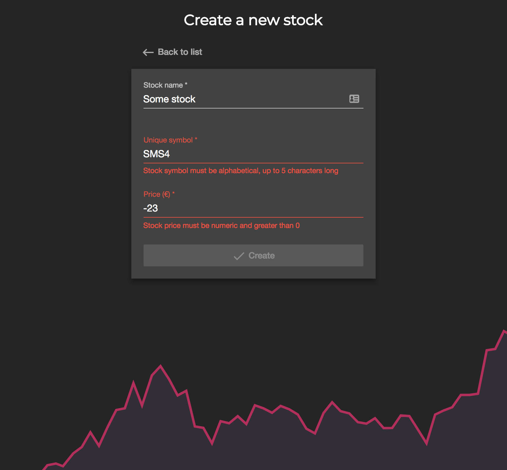

### Stocks Application

#### Notes
Please make sure to read the [notes document](NOTES.md).

If you wish to test the back-end endpoints with Postman, a collection file is present in the repository.

#### Global pre-requisites
- [Node.js](https://nodejs.org/en/) (v6.x or higher, preferably latest LTS)
- [TypeScript](https://www.npmjs.com/package/typescript) (v2.6.2 or higher)
- [Angular CLI](https://www.npmjs.com/package/@angular/cli) (v.1.50 or higher)

#### Getting started
For the sake of simplicity, the build process was designed to run from the root directory, and handle both back-end and front-end applications (since they are in the same repository).

Navigate to the repository's root directory and run the following commands:
```
npm install
npm run build
npm start
```

The application is now running at [http://localhost:3000](http://localhost:3000)

#### Unit tests
Both front-end and back-end applications are 100% covered with unit tests. To run the tests:
```
npm run test-frontend
npm run test-backend
```

### Demo images


